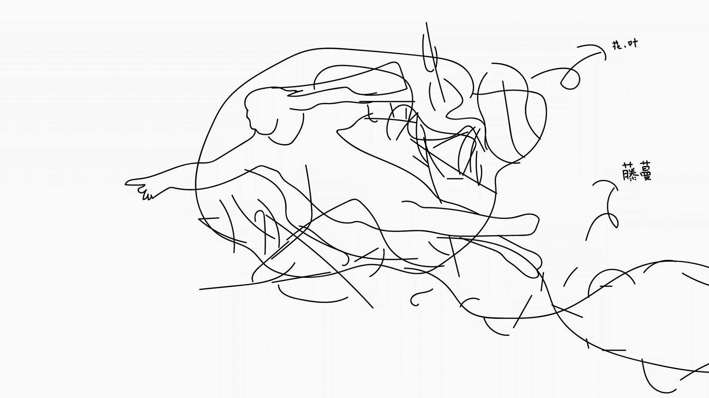
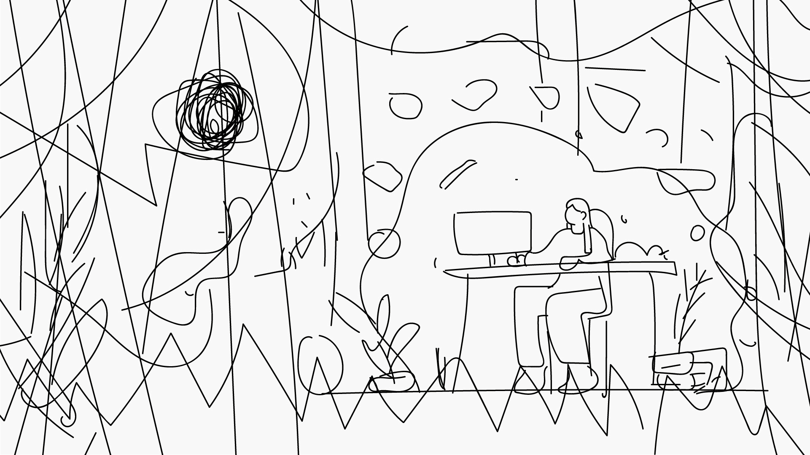

今天是记录两张插画的创作过程。

## 《创造》

第一张的灵感来自米开朗琪罗的《创造亚当》。

这幅画描绘了上帝创造亚当的情形，于是我思考，我创造了作品，那么对于作品来说，我就是上帝，以此将自己为原型创作了这幅画。

放一个绘画的过程：

绘画过程分为5个大步骤：打草稿、用色块定基本的造型背景、添加高光阴影、上色以及最后调整。

如果看不出灵感在哪里，请看《创造亚当》里上帝的姿势和我这幅画里上帝的姿势！

接下来是另一幅插画。

## 《森林里的魔法师》

这是第二张，取名为~~“社畜的理想创作环境“~~ 《森林里的魔法师》。这幅画前期构思是将理想的创作环境描绘出来，于是以自己为原型，想象自己是个正在创作的魔法师，静谧的夜晚、暖色的灯、窗外的月亮、清新的空气···正是理想的环境。

同样上个过程：

以上就是今天要记录的两张插画，希望自己能创作出更好的作品。

