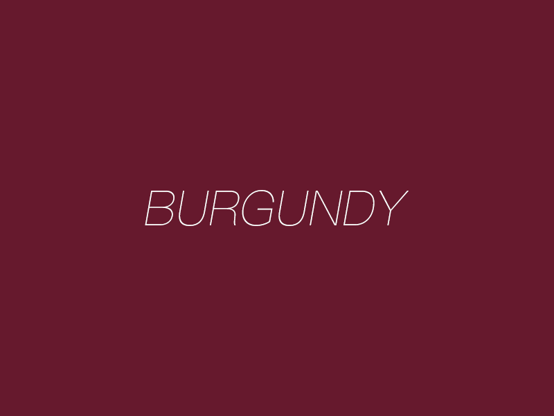
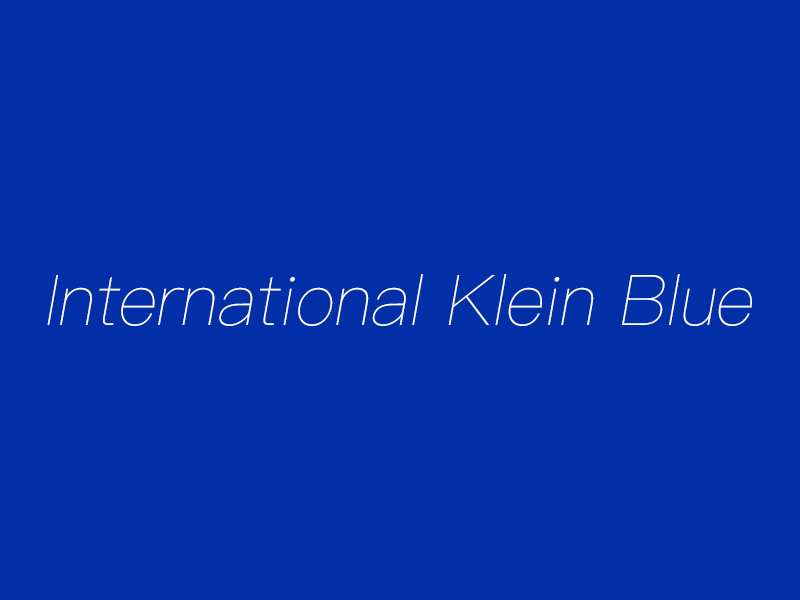
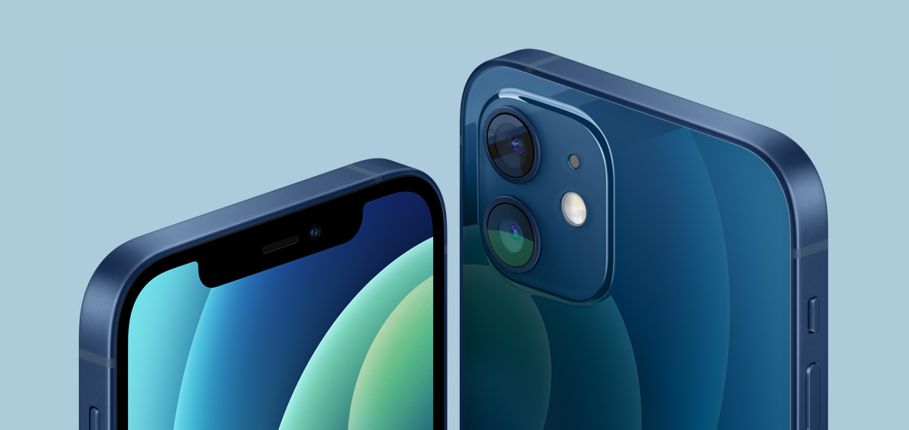

## 设计日记02期色彩篇

**勃艮第红与克莱因蓝。**

### 勃艮第红

**勃艮第酒红**（burgundy）是红色系的一种颜色，因与法国勃艮第所出产的勃艮第酒颜色相似而得名。（维基百科）

勃艮第红，第一次见这个颜色的名称时总觉得眼熟，好像在哪里见过，但是想了很久也没想起来。直到有一次，在做毫无关联的事请的情况下，猛然想起，落日飞车有首歌就叫《Burgundy Red》(勃艮第红) 。

借鉴伊夫·克莱因对蓝色的理解，那么我对红色的理解就是：

“红色是彩霞，是血液，是躁动和炙热，是爱和希望。红色是宇宙爆炸后的颜色。”

### 克莱因蓝

**国际奇连蓝**（International Klein Blue），也称克莱因蓝，是蓝色系之一。它由法国艺术家伊夫·克莱因首次混合成。国际奇连蓝具有较大的视觉冲击力，这是因为它的颜色主要是由群青构成的缘故。克莱因经常将它运用在有着厚涂及纹理丰富的油画作品中。（维基百科）

**伊夫·克莱因**（1928年4月28日 - 1962年6月6日），法国艺术家，是战后欧洲艺术界的一位重要人物。1960年，艺术批评家皮埃尔·雷斯塔尼提出新现实主义，而克莱因就是该运动的领先人物。他是行为艺术最早的推动者，同时也被视为**极简主义和波普艺术**的先驱。知名于单色画创作。（维基百科）

上世纪50年代，克莱因蓝诞生了。

克莱因蓝因其独特、具有视觉冲击力的颜色，吸引了不同行业的艺术家围绕它创造作品，比如1993年，德里克·贾曼创作的电影《蓝》，以及上世纪80年代一些摇滚乐队以“克莱因蓝”作为乐队名称、专辑名称等。

再往前翻，可能最为熟悉的还是2020年Apple发布的iPhone12，其中的蓝色就是采用了克莱因蓝。

### 后记

这篇日记主要记录最近很喜欢的两种颜色：勃艮第红和克莱因蓝。两种颜色一个暖色调，一个冷色调，亦是希望自己能对未来保持热爱，同时也能保持理智。

最后就用伊夫·克莱因对蓝色的理解做结尾吧。

“蓝色是天空，是水，是空气，是深度和无限，是自由和生命。蓝色是宇宙最本质的颜色。”

*"Blue is sky, water, air, depth and infinity, freedom and life. Blue is the most essential color of the universe."*

*——Yves Klein*

